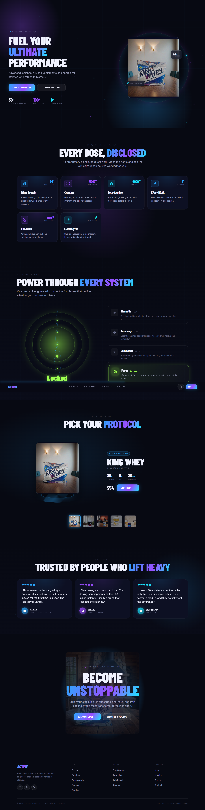

# Active — Cinematic Supplement Landing Page

A high-performance, scroll-driven landing page for **Active Nutrition** — a science-backed supplement brand. Built as a fully self-contained static site with zero frameworks, using vanilla JavaScript, CSS custom properties, and SVG/Canvas for all visual effects.



---

## Features

- **Cinematic Hero** — Full-viewport section with animated canvas particle field, floating product image, spinning ring halo, and scroll-driven parallax
- **Scroll Progress Bar** — Fixed top bar that fills as the user scrolls down the page
- **Sticky Glass Nav** — Transparent on load, blurs and darkens on scroll
- **Ingredient Cards** — 6 active ingredients with reveal-on-scroll animations, dosage chips, and icon badges
- **Performance Section** — Scroll-driven energy core that cycles through 4 performance pillars (Strength, Recovery, Endurance, Focus) as the section travels through the viewport
- **Product Showcase** — Interactive pedestal with floating product image, click-to-switch between 5 products, animated disc, and thumbnail selector
- **Testimonials** — Review cards with staggered reveal animation and canvas particle backdrop
- **CTA Section** — Parallax zoom product backdrop with "Become Unstoppable" headline
- **Footer** — 4-column grid with social links and brand copy
- **Responsive** — Collapses to single-column at 920px, stacks footer at 560px

---

## Tech Stack

| Layer | Details |
|---|---|
| Markup | Semantic HTML5, no bundler |
| Styling | Pure CSS with custom properties (design tokens) |
| Interactivity | Vanilla JavaScript (ES6+) |
| Icons | [Lucide](https://lucide.dev/) (UMD) |
| Fonts | Barlow Condensed · Inter · JetBrains Mono via Google Fonts |
| Animations | CSS keyframes + `requestAnimationFrame` canvas loops |
| Scroll effects | `IntersectionObserver` + `getBoundingClientRect` scroll tracking |

---

## Project Structure

```
active-landing/
├── index.html               # Single-file app — all HTML, CSS, and JS
├── assets/
│   └── products/
│       ├── king-whey-table.jpg
│       ├── king-whey-cabin.jpg
│       ├── creatine-watermelon.jpg
│       ├── creatine-mango.jpg
│       ├── creatine-beta-alanin.jpg
│       ├── eaa-peach.jpg
│       └── testosterone-booster.jpg
└── preview.png              # Full-page screenshot
```

---

## Running Locally

No build step required. Serve the folder with any static file server:

```bash
# Using npx serve
npx serve .

# Using Python
python -m http.server 8080

# Using VS Code Live Server
# Right-click index.html → Open with Live Server
```

Then open `http://localhost:3000` (or whichever port your server uses).

---

## Sections

| # | Section | Description |
|---|---|---|
| 1 | Hero | Headline, CTAs, spec chips, floating product |
| 2 | Formula | 6 ingredient cards — fully disclosed dosing |
| 3 | Performance | Scroll-activated energy core + 4 pillars |
| 4 | Products | Interactive showcase — 5 SKUs |
| 5 | Reviews | 3 athlete testimonials |
| 6 | CTA | "Become Unstoppable" final push |
| 7 | Footer | Links, socials, legal |

---

## Design System

Colours, spacing, and typography are defined as CSS custom properties on `:root`:

- `--blue-400` · `--violet-400` · `--cyan-400` — accent palette
- `--grad-spark` — multi-stop gradient used for text and button fills
- `--font-display` / `--font-body` / `--font-mono` — type scale
- `--space-section` — responsive section padding (`clamp`)
- `--radius-*` — border radius scale (sm → pill)

---

## Credits

Product imagery © Active Nutrition / Supplement Club.  
Icons by [Lucide](https://lucide.dev/) (ISC licence).  
Design inspired by the **Active Design System** from [claude.ai/design](https://claude.ai/design).
